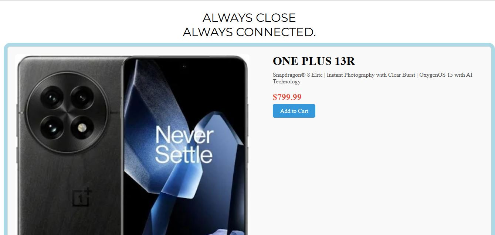
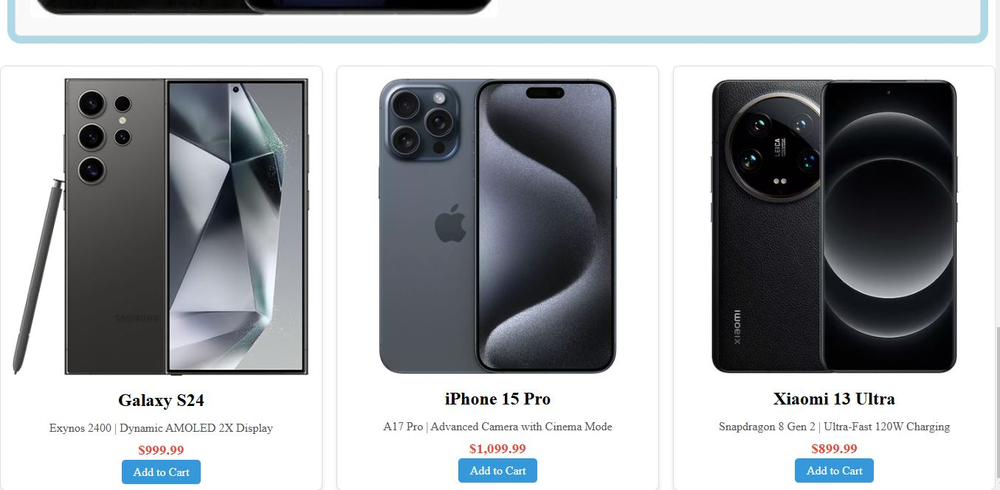

# Product Page Design

This HTML and CSS code creates a product page with a simple and professional design using Flexbox to make sure the layout adjusts well on any screen size. The page has two columns: the left column contains the product image, and the right column includes the title, description, price, and an "Add to Cart" button. Flexbox is used in the main container to arrange the columns and ensure there’s space between them. To make the design look good on smaller screens, a special rule (`@media`) is used to change how the columns are displayed, stacking them one on top of the other instead of side by side. The image container has a nice gradient background, and the image is set to 70% of the screen width. Inside the main container, the columns have adjusted sizes, with margins and padding added to keep everything neat. The product cards have a clean design with rounded corners and shadows to make them look more appealing. The "Add to Cart" buttons are blue and change when you hover over them. The whole design adjusts well on smaller screens, limiting the image size and making the buttons expand for a better fit.

## Product Images

 

  

