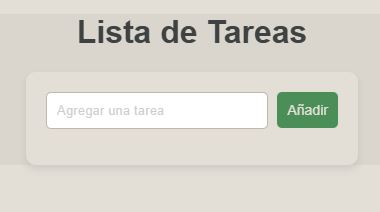
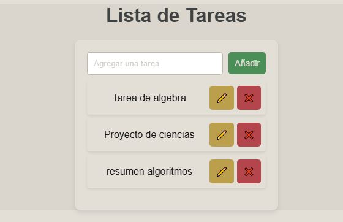
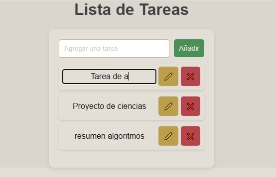

# Task List Application

## Overview

This JavaScript-based task list application allows users to:

- Add tasks via an input field and button.
- Edit tasks inline with an edit button.
- Delete tasks with a delete button.
- Render the task list dynamically using the DOM.
- Apply basic styles for a clean and modern UI.

The HTML has a field where the user can type tasks, a button to add them to the list, and an area where all tasks are displayed. In JavaScript, the logic handles updating the list whenever the user adds, edits, or deletes a task, ensuring the interface updates automatically based on the changes.

